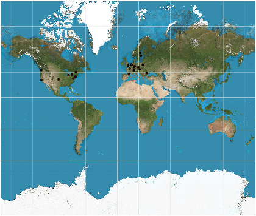
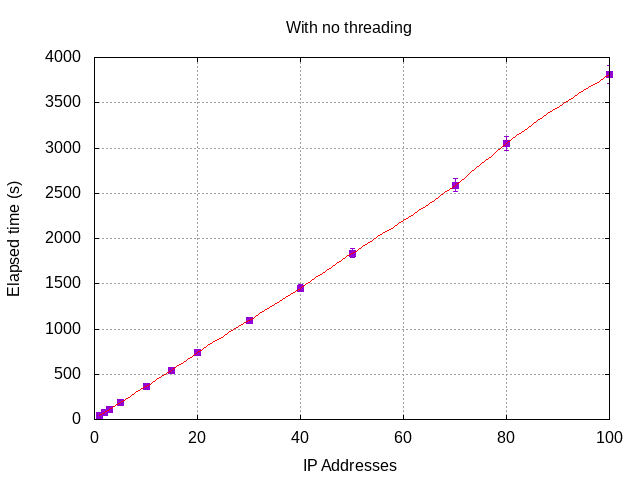
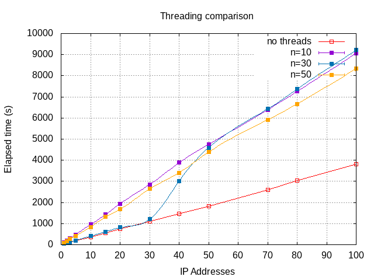

# GeoIPMap

This program plots the geographical coordinates of IPs (v4) using a
database (CSV) in a world map using the Mercator projection.

  * **Version:** 1.1.2-rc.1 (2019-03-23)
  * **Requires:** [`matplotlib`](https://matplotlib.org/),
    [`netaddr`](https://pypi.org/project/netaddr).

## Installing dependencies

Many Linux distributions already have a package manager that allows to
download this dependencies.

  * Debian:

        $ sudo apt-get install python-matplotlib
        $ sudo apt-get install python-netaddr

  * Gentoo:

        $ sudo emerge -a matplotlib
        $ sudo emerge -a netaddr

  * Arch Linux:

        $ sudo pacman -S python-matplotlib
        $ sudo pacman -S install python-netaddr

If that's not the case, you can always install them by using the `pip`
tool.

        $ python -m pip install -U matplotlib
        $ python -m pip install -U netaddr

## Basics

All needed data could be conveniently contained in the folder `data/`,
although through arguments you can specify another files or path.  The
usage of the main entry is:

        -i <IPLIST>, --iplist <IPLIST>
                            File of IPs to plot, one per line
        -g <GEODB>, --geodb <GEODB>
                            CSV document with columns: 'network,lat,lon'
        -f <IMAGEFILE>, --imagefile <IMAGEFILE>
                            Path for the template image to plot over
        -W <WIDTH>, --width <WIDTH>
                            Width in pixels of the image file
        -H <HEIGHT>, --height <HEIGHT>
                            Height in pixels of the image file
        -l <LEFT>, --left <LEFT>
                            Degrees most to the left in the image
        -r <RIGHT>, --right <RIGHT>
                            Degrees most to the right in the image
        -b <BOTTOM>, --bottom <BOTTOM>
                            Degrees most to the bottom in the image
        -n <NSPLITS>, --nsplits <NSPLITS>
                            Splits for reading 'geodb' file (threading)

You can see this options anytime by using the `-h` or `--help` argument.
The default values for the options `-l`, `-r`, and `-b` are calibrated
for the Mercator map with resolution of 2058×1746 pixels you can find in
Wikipedia, as explained below.

Three files are required for this program to work:

  * **Image file.**  This is a world map image in the Mercator
    projection.  The file properties such as `width`, `length`, and the
    degrees of left, right, and bottom boundaries depicted may be
    entered through the command line, as well as the filename.  When
    changing the image, you have to adjust three points specified in
    degrees, the point most to the left (by default is -180°), the point
    most to the right (by default is 180°), and the point most to the
    south.  It shouldn't be greater than -90°, although if you have a
    map where the most fore south point is exactly at -90°, you should
    use an approximation, such as -89.99, or a division by zero may
    happen because the linear scale becomes infinitely large at the
    poles in this projection.

    The default map for the configured settings is the one you can find
    in Wikipedia for the article: "[Mercator
    Projection](https://en.wikipedia.org/wiki/Mercator_projection)", but
    in the size of 2058×1746 pixels.  It's set between 82°S and 82°N,
    *i.e.*, with latitudes in the range [-82, 82].

    You can download and use a different map, or the same map in a
    different resolution, but you'll have to specify the dimensions and
    other parameters through the command line when invoking the program.

  * **IP list.**  A file of the IPs you want to plot in a map.  There
    have to be IP addresses, not in subnet notation or netmasks, one
    per line.  By default, the file used will be `data/ips.lst`.  For
    example:

        ...
        77.247.181.162
        198.98.56.149
        185.220.100.252
        162.247.74.202
        195.176.3.19
        145.239.91.37
        185.220.101.54
        51.15.125.181
        ...

  * **Geocoordinates database.**  A CSV file containing the following
    columns, without comments (may be this will be solved in a future
    version): `netmask, latitude, longitude`.  The default CSV file used
    is `data/geoip_ipv4.csv`.  For example:

        ...
        73.185.104.0/23,37.8209,-121.2827
        73.185.106.0/23,38.6106,-121.2789
        73.185.108.0/23,38.5879,-121.4053
        73.185.110.0/23,38.6711,-121.1495
        73.185.112.0/23,36.3170,-119.3087
        73.185.114.0/23,38.1345,-120.4516
        73.185.116.0/23,39.1663,-121.5105
        ...

## Quick usage

  1. Download the Mercator map (2058×1746 pixels) from Wikipedia:
    <https://upload.wikimedia.org/wikipedia/commons/f/f4/Mercator_projection_SW.jpg>
    and save it in the `data` folder under the name of
    `worldmap_raw.jpg`.

  2. Put a file containing the IPs you want to plot (one per line) in
     the map in the folder `data` under the name of `ips.lst`.

  3. Create a CSV database with the columns:
     `netmask,latitude,longitude` and save it in the folder `data`under
     the name `geoip_ipv4.csv`.  See below.

## Generating a CSV database

The CSV database of 'network, longitude, latitude' is not included due
its weight, but it can be constructed easily.

  1. Download from [MaxMind](https://dev.maxmind.com) the GeoLite2 City
     database in CSV format.  You'll find it at:
  <https://geolite.maxmind.com/download/geoip/database/GeoLite2-City-CSV.zip>.

  2. Uncompress that file and work with the
     `GeoLite2-City-Blocks-IPv4.csv` file.  It's a very huge file and
     has much more information that the needed for this program to run.

  3. Create a new document using the following command:

        `$ awk -F',' '{print $1","$8","$9}' GeoLite2-City-Blocks-IPv4.csv >geoip_ipv4.csv`

     Put the output file in the `data` directory with the name
     `geoip_ipv4.csv`.

## Using custom files

The only requirement is the format of the files and the projection used
in the map.  You can use different filenames specifying them in the
option arguments:

Instead `python main.py`, you may use:

        $ python main.py -i <my_iplist> -g <my_geodb> -f <my_image> -b -80

When changing the image, you have to specify, at least, the degrees more
to the south the map displays (and in some cases, the points more to the
west and/or to the right when the map is not calibrated in between 180°W
and 180°E, *i.e.*, the range [-180, 180], for degrees of longitude.

## Output and display

This is an example of the output provided by this program using
`matplotlib`.  This image is a zoomed detail.

<!--  -->

The red dots indicate each one of the locations of the IPs in the file
`ips.lst`.  The radius of this circle is calculated automatically in the
function `plot_pixels` (in the `geoipmap.py` file).

The automatic calculation provides a way to draw the circles with a size
in relation to the image size.  The computation is performed by getting
the biggest dimension of the image, and set the radius to a 0.3% of this
length, so, for the most common resolutions:

| Resolution  | Radius |
|:-----------:|-------:|
|   800×600   |  2.400 |
|  1024×768   |  3.072 |
|  1280×1024  |  3.840 |
|  1920×1080  |  5.760 |
|  3840×2160  | 11.520 |
|  7680×4320  | 23.040 |

The default image detailed above has a resolution of 2058×1746 pixels,
so its radius will be 6.174 pixels.

This default behaviour can be altered by invoking the `plot_pixels`
function with an extra argument indicating the float value of the radius
in pixels.

        # Automatic radius
        geo.plot()

        # User defined radius
        geo.plot(radius=10)

This function is invoked in the main entry, at the end of the file
`main.py`.

**NOTE.**  This method will be probably changed in the future to a much
better approximation.

## Benchmarks and threading

The CSV database is enormous, and it contains data in CIDR (Classless
InterDomain Routing) subnet mask notation.  Thanks to `netaddr` it's
easy to check if an IP address belongs to a specific network, but this
check has to be performed for all IPs in `ip.lst`.  The file
`geoip_iv4.csv`, obtained as explained before, is around 101MiB, this
translated to 3,235,808 lines, each one for one netmask.

Since version 1.1.2, `GeoIPMap` is a class instead of individual
functions, and now it has two methods to do this task.  One is
`__ips_to_pixels_nothreading` (previous and old function
`ips_to_pixels`) and the other `__ips_to_pixels_threading`.  I think the
name is autoexplicative.  Both methods are private and managed by
`ips_to_pixels` (the new method) who calls one or the other depending on
how the object `GeoIPMap` was instantiated.

        geo = GeoIpMap(iplist_filename, geodb_filename, image_object,
                       num_splits=20, verbose=True)

The argument `num_splits` tells the `GeoIpMap` object how many _splits_
in the performing of this task, which is to transverse across a big
file.  If the number the _splits_ is one, there will be no threading and
`ips_to_pixels` will invoke `__ips_to_pixels_nothreading`.  If the
parameter is any integer greater than one, the method will invoke
`__ips_to_pixels_threading` performing the task with that many _splits_.

Here are some benchmarks.
All tests performed in a Intel(R) Core(TM) i7-3820 CPU @ 3.60GHz.

### Using `__ips_to_pixels_nothreading`:

| Number of IPs | Elapsed time (s) | Elapsed time (min) |
|:-------------:| ----------------:| -----------------: |
|        1      |      41.957      |        0.699       |
|        2      |      77.814      |        1.297       |
|        3      |     114.390      |        1.906       |
|        5      |     186.723      |        3.112       |
|       10      |     367.387      |        6.123       |
|       15      |     546.477      |        9.108       |
|       20      |     738.865      |       12.314       |
|       30      |    1097.268      |       18.288       |
|       40      |    1452.540      |       24.209       |
|       50      |    1835.117      |       30.585       |
|       70      |    2589.551      |       43.159       |
|       80      |    3047.234      |       50.787       |
|      100      |    3808.751      |       63.479       |

The algorithm of getting the latitude and longitude for a IP address to
be later translated into pixel coordinates requires work, for it's still
very slow.

The result is linear, as expected, but the elapsed time makes the
program unusable.  For 100 IPs, there's one hour of waiting...

### Using `__ips_to_pixels_threading`:

Here, the results are separated by different values of `num_splits`.

#### `nsplits=10`

| Number of IPs | Elapsed time (s) | Elapsed time (min) |
|:-------------:| ----------------:| -----------------: |
|        1      |     102.434      |        1.707       |
|        2      |     194.546      |        3.242       |
|        3      |     290.462      |        4.841       |
|        5      |     481.067      |        8.018       |
|       10      |     958.010      |       15.967       |
|       15      |    1432.346      |       23.872       |
|       20      |    1937.759      |       32.296       |
|       30      |    2851.271      |       47.521       |
|       40      |    3881.450      |       64.691       |
|       50      |    4752.828      |       79.214       |
|       70      |    6392.207      |      106.537       |
|       80      |    7259.507      |      120.992       |
|      100      |    9065.384      |      151.240       |

#### `nsplits=30`

| Number of IPs | Elapsed time (s) | Elapsed time (min) |
|:-------------:| ----------------:| -----------------: |
|        1      |      47.287      |        0.788       |
|        2      |      86.146      |        1.436       |
|        3      |     124.116      |        2.069       |
|        5      |     203.531      |        3.392       |
|       10      |     407.058      |        6.784       |
|       15      |     612.549      |       10.209       |
|       20      |     817.889      |       13.631       |
|       30      |    1202.130      |       20.036       |
|       40      |    3010.490      |       50.175       |
|       50      |    4590.970      |       76.516       |
|       70      |    6427.190      |      107.120       |
|       80      |    7368.440      |      122.807       |
|      100      |    9215.480      |      153.591       |

#### `nsplits=50`

| Number of IPs | Elapsed time (s) | Elapsed time (min) |
|:-------------:| ----------------:| -----------------: |
|        1      |       93.531     |        1.559       |
|        2      |      169.788     |        2.830       |
|        3      |      264.078     |        4.401       |
|        5      |      415.901     |        6.932       |
|       10      |      840.006     |       14.000       |
|       15      |     1314.220     |       21.904       |
|       20      |     1677.780     |       27.963       |
|       30      |     2640.680     |       44.011       |
|       40      |     3409.390     |       56.823       |
|       50      |     4382.410     |       73.040       |
|       70      |     5914.550     |       98.576       |
|       80      |     6669.770     |      111.163       |
|      100      |     8337.464     |      138.958       |

For 2, 5 and 10 _splits_, the results are much worse than the ones
without threading.  It takes, more or less, double time in this case.
For even more _splits_, there's no much difference.  Al least, the CPU
load is divided in between that many cores.

<!-- Image here -->

This is due the _Global Interpreter Lock_, so the default settings for
this program will be to use no threads, *i.e*, to se `nsplits` to zero
by default.  From:
<https://docs.python.org/3/c-api/init.html#thread-state-and-the-global-interpreter-lock>:

> The Python interpreter is not fully thread-safe. In order to support
> multi-threaded Python programs, there’s a global lock, called the
> global interpreter lock or GIL, that must be held by the current
> thread before it can safely access Python objects. Without the lock,
> even the simplest operations could cause problems in a multi-threaded
> program: for example, when two threads simultaneously increment the
> reference count of the same object, the reference count could end up
> being incremented only once instead of twice.

**TODO.**  In the next version, instead of using `threading`, use
[`multiprocessing`](https://docs.python.org/3.7/library/multiprocessing.html),
that uses an API very similar to the `threading` module but offers
concurrency bypassing the Global Interpreter Lock.

## License

This program is under the BSD 2-Clause license.  This license has also
been called the "Simplified BSD License" and the "FreeBSD License".

    Redistribution and use in source and binary forms, with or without
    modification, are permitted provided that the following conditions
    are met:

      1. Redistributions of source code must retain the above copyright
         notice, this list of conditions and the following disclaimer.

      2. Redistributions in binary form must reproduce the above
         copyright notice, this list of conditions and the following
         disclaimer in the documentation and/or other materials provided
         with the distribution.

    THIS SOFTWARE IS PROVIDED BY THE COPYRIGHT HOLDERS AND CONTRIBUTORS
    "AS IS" AND ANY EXPRESS OR IMPLIED WARRANTIES, INCLUDING, BUT NOT
    LIMITED TO, THE IMPLIED WARRANTIES OF MERCHANTABILITY AND FITNESS
    FOR A PARTICULAR PURPOSE ARE DISCLAIMED. IN NO EVENT SHALL THE
    COPYRIGHT HOLDER OR CONTRIBUTORS BE LIABLE FOR ANY DIRECT, INDIRECT,
    INCIDENTAL, SPECIAL, EXEMPLARY, OR CONSEQUENTIAL DAMAGES (INCLUDING,
    BUT NOT LIMITED TO, PROCUREMENT OF SUBSTITUTE GOODS OR SERVICES;
    LOSS OF USE, DATA, OR PROFITS; OR BUSINESS INTERRUPTION) HOWEVER
    CAUSED AND ON ANY THEORY OF LIABILITY, WHETHER IN CONTRACT, STRICT
    LIABILITY, OR TORT (INCLUDING NEGLIGENCE OR OTHERWISE) ARISING IN
    ANY WAY OUT OF THE USE OF THIS SOFTWARE, EVEN IF ADVISED OF THE
    POSSIBILITY OF SUCH DAMAGE.

The BSD 2-clause license allows you almost unlimited freedom with the
software so long as you include the BSD copyright notice in it (found in
the `LICENSE` file).

Under this license, you may:

  * use the software for commercial use;
  * modify the software and create derivatives;
  * distribute original or modified works;
  * place warranty on the software licensed.

You must:

  * include copyright
  * include the full text of license in modified software.

More information about the license:
<https://en.wikipedia.org/wiki/BSD_licenses#2-clause>.

---

J. A. Corbal, 2019.

