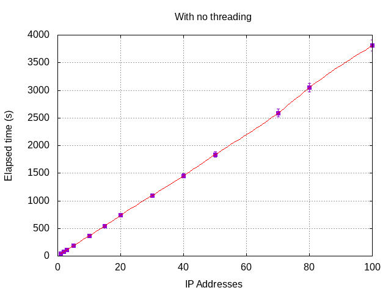
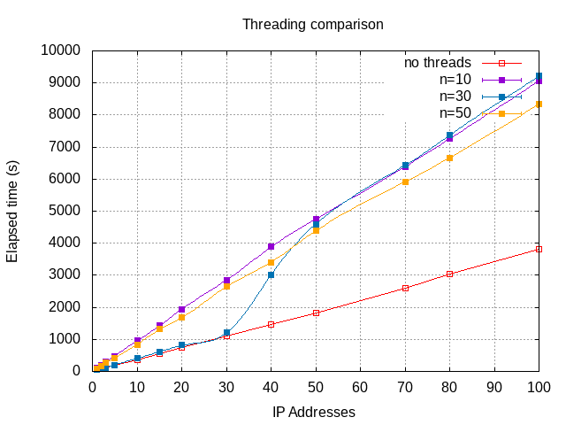
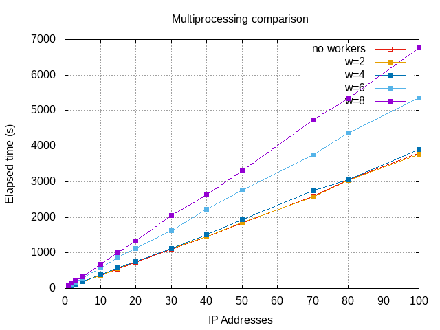

# Benchmarks

**NOTE.**  Both the threading support and the multiprocessing support
are wrongly implemented, as they results are worst than the method
without any parallelism.

The CSV database is enormous, and it contains data in CIDR (Classless
InterDomain Routing) subnet mask notation.  Thanks to `netaddr` it's
easy to check if an IP address belongs to a specific network, but this
check has to be performed for all IPs in `ip.lst`.  The file
`geoip_iv4.csv`, obtained as explained before, is around 101MiB, this
translated to 3,235,808 lines, each one for one netmask.

## Thread-based parallelism

Since version 1.1.2, `GeoIPMap` is a class instead of individual
functions, and now it has two methods to do this task.  One is
`__ips_to_pixels_raw` (previous and old function `ips_to_pixels`) and
the other `__ips_to_pixels_threading` using the [`threading`
module](https://docs.python.org/3.7/library/threading.html?highlight=threading#module-threading).
I think the name is autoexplicative.  Both methods are private and
managed by `ips_to_pixels` (the new method) who calls one or the other
depending on how the object `GeoIPMap` was instantiated.

        geo = GeoIpMap(iplist_filename, geodb_filename, image_object,
                       num_splits=20, verbose=True)

The argument `num_splits` tells the `GeoIpMap` object how many _splits_
in the performing of this task, which is to transverse across a big
file.  If the number the _splits_ is one, there will be no threading and
`ips_to_pixels` will invoke `__ips_to_pixels_raw`.  If the parameter is
any integer greater than one, the method will invoke
`__ips_to_pixels_threading` performing the task with that many _splits_.

Here are some benchmarks.
All tests performed in a Intel(R) Core(TM) i7-3820 CPU @ 3.60GHz.

### Using `__ips_to_pixels_raw`:

| Number of IPs | Elapsed time (s) | Elapsed time (min) |
|:-------------:| ----------------:| -----------------: |
|        1      |      41.957      |        0.699       |
|        2      |      77.814      |        1.297       |
|        3      |     114.390      |        1.906       |
|        5      |     186.723      |        3.112       |
|       10      |     367.387      |        6.123       |
|       15      |     546.477      |        9.108       |
|       20      |     738.865      |       12.314       |
|       30      |    1097.268      |       18.288       |
|       40      |    1452.540      |       24.209       |
|       50      |    1835.117      |       30.585       |
|       70      |    2589.551      |       43.159       |
|       80      |    3047.234      |       50.787       |
|      100      |    3808.751      |       63.479       |

The algorithm of getting the latitude and longitude for a IP address to
be later translated into pixel coordinates requires work, for it's still
very slow.

The result is linear, as expected, but the elapsed time makes the
program unusable.  For 100 IPs, there's one hour of waiting...

### Using `__ips_to_pixels_threading`:

Here, the results are separated by different values of `num_splits`.

#### `nsplits=10`

| Number of IPs | Elapsed time (s) | Elapsed time (min) |
|:-------------:| ----------------:| -----------------: |
|        1      |     102.434      |        1.707       |
|        2      |     194.546      |        3.242       |
|        3      |     290.462      |        4.841       |
|        5      |     481.067      |        8.018       |
|       10      |     958.010      |       15.967       |
|       15      |    1432.346      |       23.872       |
|       20      |    1937.759      |       32.296       |
|       30      |    2851.271      |       47.521       |
|       40      |    3881.450      |       64.691       |
|       50      |    4752.828      |       79.214       |
|       70      |    6392.207      |      106.537       |
|       80      |    7259.507      |      120.992       |
|      100      |    9065.384      |      151.240       |

#### `nsplits=30`

| Number of IPs | Elapsed time (s) | Elapsed time (min) |
|:-------------:| ----------------:| -----------------: |
|        1      |      47.287      |        0.788       |
|        2      |      86.146      |        1.436       |
|        3      |     124.116      |        2.069       |
|        5      |     203.531      |        3.392       |
|       10      |     407.058      |        6.784       |
|       15      |     612.549      |       10.209       |
|       20      |     817.889      |       13.631       |
|       30      |    1202.130      |       20.036       |
|       40      |    3010.490      |       50.175       |
|       50      |    4590.970      |       76.516       |
|       70      |    6427.190      |      107.120       |
|       80      |    7368.440      |      122.807       |
|      100      |    9215.480      |      153.591       |

#### `nsplits=50`

| Number of IPs | Elapsed time (s) | Elapsed time (min) |
|:-------------:| ----------------:| -----------------: |
|        1      |       93.531     |        1.559       |
|        2      |      169.788     |        2.830       |
|        3      |      264.078     |        4.401       |
|        5      |      415.901     |        6.932       |
|       10      |      840.006     |       14.000       |
|       15      |     1314.220     |       21.904       |
|       20      |     1677.780     |       27.963       |
|       30      |     2640.680     |       44.011       |
|       40      |     3409.390     |       56.823       |
|       50      |     4382.410     |       73.040       |
|       70      |     5914.550     |       98.576       |
|       80      |     6669.770     |      111.163       |
|      100      |     8337.464     |      138.958       |

For 2, 5 and 10 _splits_, the results are much worse than the ones
without threading.  It takes, more or less, double time in this case.
For even more _splits_, there's no much difference.  Al least, the CPU
load is divided in between that many cores.

This is due the _Global Interpreter Lock_, so threads are not
recommended for this program (at least, not in the way that
functionality was implemented), but the options are still there just in
case.  From:
<https://docs.python.org/3/c-api/init.html#thread-state-and-the-global-interpreter-lock>:

> The Python interpreter is not fully thread-safe. In order to support
> multi-threaded Python programs, there’s a global lock, called the
> global interpreter lock or GIL, that must be held by the current
> thread before it can safely access Python objects. Without the lock,
> even the simplest operations could cause problems in a multi-threaded
> program: for example, when two threads simultaneously increment the
> reference count of the same object, the reference count could end up
> being incremented only once instead of twice.

## Process-based parallelism

Since version 1.2.0, and due the low efficiency of the threading
implementation, a new function does the task of looking up in the
database and getting the results.  It uses the 
[`multiprocessing` module](https://docs.python.org/3.7/library/multiprocessing.html)
in order to avoid the issues with the Global Interpreter Lock.  It's
name is `__ips_to_pixels_multiprocessing`.

These are the results:

### nworkers=2

| Number of IPs | Elapsed time (s) | Elapsed time (min) |
|:-------------:| ----------------:| -----------------: |
|        1      |       42.664     |        0.711       |
|        2      |       81.431     |        1.357       |
|        3      |      122.145     |        2.036       |
|        5      |      195.202     |        3.253       |
|       10      |      369.304     |        6.155       |
|       15      |      552.653     |        9.211       |
|       20      |      761.765     |        12.696      |
|       30      |      1130.130    |        18.836      |
|       40      |      1458.650    |        24.311      |
|       50      |      1864.440    |        31.074      |
|       70      |      2568.700    |        42.812      |
|       80      |      3030.660    |        50.511      |
|      100      |      3767.743    |        62.796      |

### nworkers=4

| Number of IPs | Elapsed time (s) | Elapsed time (min) |
|:-------------:| ----------------:| -----------------: |
|       1       |        44.529    |        0.742       |
|       2       |        84.069    |        1.401       |
|       3       |       122.944    |        2.049       |
|       5       |       199.245    |        3.321       |
|      10       |       385.369    |        6.423       |
|      15       |       580.742    |        9.679       |
|      20       |       758.028    |       12.634       |
|      30       |      1124.970    |       18.750       |
|      40       |      1508.080    |       25.135       |
|      50       |      1931.720    |       32.195       |
|      70       |      2738.590    |       45.643       |
|      80       |      3047.260    |       50.788       |
|     100       |      3909.775    |       65.163       |

### nworkers=6

| Number of IPs | Elapsed time (s) | Elapsed time (min) |
|:-------------:| ----------------:| -----------------: |
|       1       |        61.155    |         1.019      |
|       2       |       124.543    |         2.076      |
|       3       |       168.077    |         2.801      |
|       5       |       282.711    |         4.712      |
|      10       |       572.524    |         9.542      |
|      15       |       865.438    |        14.424      |
|      20       |      1125.570    |        18.759      |
|      30       |      1620.980    |        27.016      |
|      40       |      2228.000    |        37.133      |
|      50       |      2758.890    |        45.981      |
|      70       |      3753.470    |        62.558      |
|      80       |      4363.330    |        72.722      |
|     100       |      5358.870    |        89.315      |

### nworkers=8

| Number of IPs | Elapsed time (s) | Elapsed time (min) |
|:-------------:| ----------------:| -----------------: |
|       1       |        75.173    |        1.253       |
|       2       |       145.124    |        2.419       |
|       3       |       206.693    |        3.445       |
|       5       |       337.775    |        5.630       |
|      10       |       677.963    |       11.299       |
|      15       |      1008.850    |       16.814       |
|      20       |      1334.820    |       22.247       |
|      30       |      2044.890    |       34.081       |
|      40       |      2637.910    |       43.965       |
|      50       |      3314.680    |       55.245       |
|      70       |      4733.140    |       78.886       |
|      80       |      5341.980    |       89.033       |
|     100       |      6761.770    |      112.696       |

So... something is wrong and it will be fixed in the next version.

